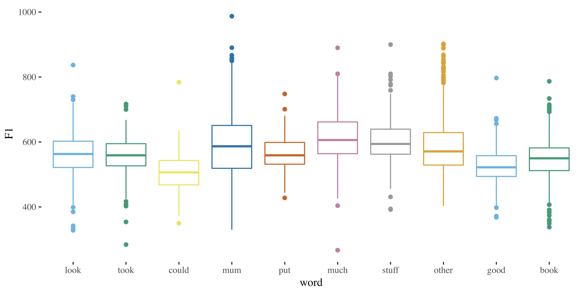

```{r setup, include=FALSE}
knitr::opts_chunk$set(echo = TRUE)
```

Welcome to the course website for SEL3094 Accents of English and SEL8513 Variation and the Grammar.



## Overview

This module explores the phonological, phonetic and sociolinguistic features of accents of English.  We'll be looking at the particular sounds which differentiate varieties of English, and how to identify linguistic and social factors which may play a role in shaping this variation.  Each week, we'll focus on a different aspect of English accents, including phonological processes and regional differences.  We'll be using quantitative methods to look at variation in particular accents, as well as more advanced phonetic tools available in linguistics.

To succeed in this course you must already possess certain background knowledge and skills. The formal pre-requisite for this module is SEL1027, and as such students are expected to be familiar with the staples of phonology and phonetics.  You must be able to produce and recognise the IPA symbols for the most common sounds found in the languages of the world in order to embark on this course.

## Contact
Email: danielle.turton@newcastle.ac.uk

Please allow at least 2 working days for a response.  Note that Friday is my dedicated research day and I am not on email.

Office hours: Mon 3-4, Weds 11-1 (Percy 3.11A)

Phone: 0191 208-8092


## Attendance

Attendance is monitored automatically through the scan devices installed in each teaching room.  I do not have access to these devices, so if you forget to scan in, there’s nothing I can do.  If you know that you will miss a class due to a religious holiday or an athletic event, please let me know in the first two weeks of the semester.

```{r pressure, echo=FALSE}
plot(pressure)
```

Note that the `echo = FALSE` parameter was added to the code chunk to prevent printing of the R code that generated the plot.


## Course materials
Lecture slides and lab instructions will be available on the [Blackboard](https://blackboard.ncl.ac.uk/) site for this module.  

Readings are available from the schedule tab (or from the protected module folder)for some readings, you will need to be logged into your Newcastle account to gain access).

## Useful stuff

* Printable [IPA chart](https://www.internationalphoneticassociation.org/sites/default/files/IPA_Kiel_2015.pdf)
* [Wells's Lexical Sets](https://en.wikipedia.org/wiki/Lexical_set)


